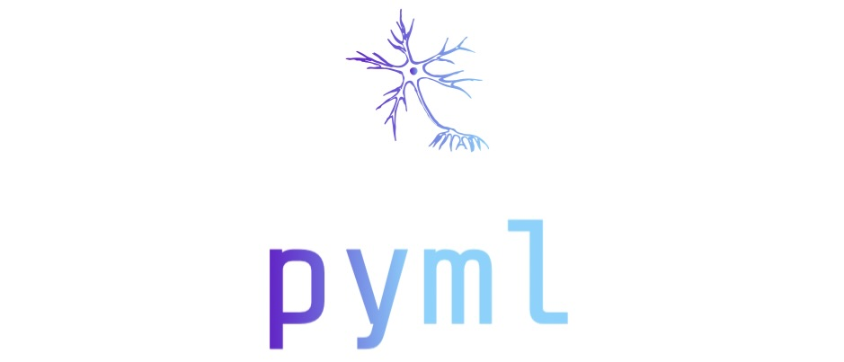

# PyML - a simple machine learning library


PyML is an exciting personal project dedicated to the exploration and implementation of fundamental machine learning algorithms entirely from scratch using mainly Python and NumPy. The core vision behind PyML is to provide a platform for continuous learning and hands-on experience in the realm of machine learning. As I learn or discover new concepts and algorithms, they are meticulously coded and integrated into PyML, contributing to a growing repository of custom-built machine learning tools. While PyML is not intended for production use, as it lacks CUDA support and may not be optimized for speed, it serves as an invaluable educational resource for those looking to deepen their understanding of machine learning algorithms and their inner workings. Whether you're a novice seeking to grasp the fundamentals or an enthusiast keen to explore the nuances of machine learning, PyML welcomes you to join in the journey of learning and building together.

## Contributions

To contribute to this project, you must first clone the repository.
```sh
git clone https://github.com/Irish-77/py-ml.git
```
### Documentation
This package puts a great emphasis on ease of use and simple contributions without much extra complexity. Therefore, in addition to clean code, the documentation is also essential.
To document, install the following packages as follows:
```sh
pip install -r requirements_docs.txt
```
Make sure that [Sphinx](https://www.sphinx-doc.org/en/master/usage/installation.html) and [Pandoc](https://pandoc.org/installing.html) are also installed.

To open the documentation on a local web server execute following command:
```sh
sphinx-autobuild docs/source/ docs/build/html/
```
Usually, the web server can be accessed under the address _http://127.0.0.1:8000_.

Please follow Numpy's and Google's guidelines for writing docstrings.

### Testing
It is recommended to develop test cases for new modules/classes/individual functions. These are located in the directory pyml/tests.